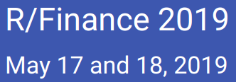
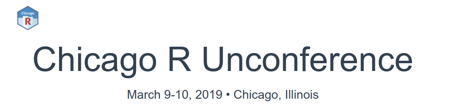
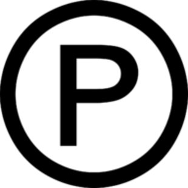

```{r setup, include=FALSE}
knitr::opts_chunk$set(echo = FALSE)
library(RUGtools)
```

## Chicago R User Group (CRUG) ...

- Happy New YeaR! Welcome new and current useRs! 
- CRUG enters its 9th year of meetups since 2010!
- Now reached 3,500 members, one of largest groups in world!

    **Slack**
     
    [bit.ly/Slack-CRUG](http://bit.ly/Slack-CRUG)

    **Twitter**
    
    [ChicagoRusers](https://twitter.com/ChicagoRusers)

    **GitHub**
    
    @[Chicago-R-User-Group](https://github.com/Chicago-R-User-Group)

    **Meetup**
    
    [ChicagoRUG](https://www.meetup.com/ChicagoRUG/)

    **Website**
    
    [Chicago-r-user-group.github.io](https://chicago-r-user-group.github.io/)

# Local R News

## 

<br/>

From the inaugural conference in 2009, the annual R/Finance conference in Chicago has become the primary meeting for academics and practitioners interested in using R in Finance.

Call for Papers (live today!)

https://uic.cvent.com/rfinance2019CFP


## 


<br/>
Next Meetup: 

- Monday, January 28th: What We Learned at rstudio::conf 2019: Lightning Talks!

For more information find them:

https://rladieschicago.org/>

@[RLadiesChicago](https://twitter.com/RLadiesChicago)

[Meetup.com/R-Ladies Chicago](https://www.meetup.com/rladies-chicago/)

##


<br/>

https://chirunconf.github.io

# Local Chicago Tech

## 


**ChicagoPolyglot Winter Mingle**

http://chicagopolyglot.com/

Opportunity to hang out and network with friends and colleagues across Chicago's expansive tech community. The word "polyglot" means "knowing or using several langauges", so look for friends from CJUG, ChiPy, ChicagoRuby and other vibrant Chicago tech meetup groups as we share our passion for learning and technology in a relaxed setting.

Wednesday, January 30, 2019, 6:00 PM – 8:00 PM CST

Sully's House, 1501 N Dayton, Chicago, IL

## 


<br/>

https://windycity.devfest.io/

A community-run conference offering sessions, hack-a-thons, and codelabs across many different technologies.

DePaul University Loop Campus DePaul Center

1 East Jackson, Chicago, IL


# Anyone hiring R folks? 

# Tonight's Sponsor

## 


WeWork provides shared workspaces for technology startup, and services for entrepreneurs, freelancers, startups, small businesses and large enterprises. 

Thanks Dr. Dale Rosenthal for providing his WeWork space for tonight's meetup!

<br/>


IBM for sponsoring food and beverages!


# Tonight's Event

## Single-Function Lightning Rounds


**Speakers**

1. **Chase Clark** - lengths, 5-10 mins.
2. **Nathan Frey** - cat, 5-10 mins.
3. **Brandon Allen** - merge/subset, 10-15 mins.
4. **Parfait Gasana** - by, 5-10 mins.
5. **Dale Rosenthal** - optim, 5-10 mins.
6. **Justin Shea** - data.table::melt, 5-10 mins.
7. **Ray Buhr** - future.apply::future_lapply, 5-10 mins.
8. **Brian Burns** - pkgnet::CreatePackageReport, 5-10 mins. 


